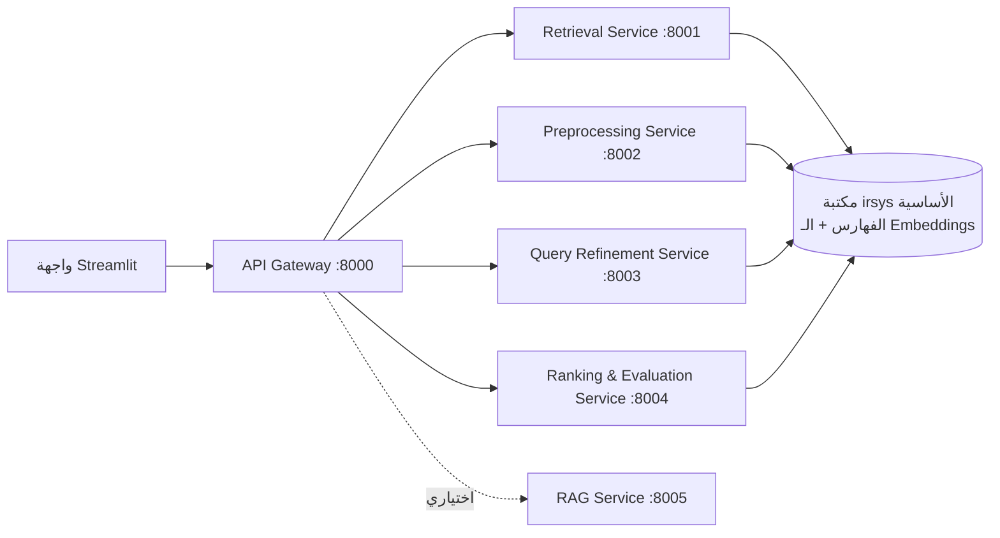

# تقرير مشروع نظم استرجاع المعلومات (Information Retrieval System) — 2026

> محرك بحث متكامل مبني وفق مبدأ **SOA**، بلغة **Python** حصراً، مع تسريع على الـ GPU
> لتمثيلات الـ Embeddings، وتقييم كامل وفق مقاييس IR القياسية.

---

## 1. مقدمة ونظرة عامة

الهدف بناء **محرك بحث** قادر على استرجاع الوثائق ذات الصلة باستعلام المستخدم من مجموعة بيانات
كبيرة، مع تطبيق المبادئ الأساسية في استرجاع المعلومات: المعالجة المسبقة، التمثيل (Representation)،
الفهرسة (Indexing)، معالجة الاستعلام، المطابقة والترتيب، والتقييم (Evaluation).

تم تصميم النظام على شكل مجموعة من **الخدمات المستقلة** (Service Oriented Architecture) يمكن
تشغيل واختبار كل منها على حدة، وربطها عبر **بوابة API (API Gateway)**، مع واجهة مستخدم بسيطة
بـ Streamlit للتجربة.

---

## 2. مجموعة البيانات (Dataset)

| الخاصية | القيمة |
|---|---|
| المصدر | [ir-datasets.com](https://ir-datasets.com) — `beir/quora/test` |
| عدد الوثائق | **522,931** وثيقة |
| عدد الاستعلامات (queries) | **10,000** استعلام |
| ملف الحُكم (qrels) | متوفّر ✓ (شرط أساسي للتقييم) |
| اللغة | الإنجليزية |

- المجموعة تحقق شرط **أكثر من 200K وثيقة**، وتحتوي على **qrels** (وهو الشرط الأهم للتقييم).
- لم يتم استخدام مجموعة **Antique** (ممنوعة).
- في التقييم تُستخدم **كل** الاستعلامات الموجودة في ملف الـ qrels (10,000 استعلام) — ويُطبع
  العدد في مخرجات نوتبوك التقييم `notebooks/evaluation.ipynb`.

كل وثيقة لها مُعرّف (doc_id)، وتُعرض الوثائق في الواجهة **بنصّها الأصلي (غير المنظّف)** مع مُعرّفها.

---

## 3. بنية النظام (SOA)



- **فصل واضح للمسؤوليات**: كل خدمة مسؤولة عن مهمة واحدة.
- **التواصل** بين الخدمات عبر **REST API** (يستخدم الـ Gateway مكتبة requests للتمرير).
- **قابلية التشغيل المستقل**: كل خدمة لها أمر تشغيل خاص (`uvicorn services.<name>:app`).
- **كود منظّم وقابل لإعادة الاستخدام**: كل المنطق في مكتبة مشتركة `src/irsys/`، والخدمات
  مجرد أغلفة رفيعة (Thin wrappers) فوقها — ما يحقق **Loose Coupling** و**Reusability**.
- الواجهة تدعم وضعين: **Gateway (SOA)** لاستدعاء الخدمات، و**Direct** لتحميل المحرك ضمن
  العملية نفسها (احتياطي يعمل أوفلاين بالكامل أثناء المقابلة).

الخدمات:
1. **Preprocessing Service** — تطبيق سلسلة المعالجة المسبقة على أي نص.
2. **Retrieval Service** — يحمّل الفهارس والـ Embeddings ويخدم البحث بكل أنماط التمثيل.
3. **Query Refinement Service** — تصحيح إملائي، توسيع بالمرادفات، اقتراحات.
4. **Ranking & Evaluation Service** — تقديم تقارير التقييم وتقييم استعلام مفرد.
5. **API Gateway** — نقطة الدخول الموحّدة للواجهة.
6. **RAG Service** (اختياري) — محادثة معتمدة على الاسترجاع بنموذج لغوي محلي.

---

## 4. الخدمات والمتطلبات الأساسية بالتفصيل

### 4.1 المعالجة المسبقة (Data Pre-Processing)
الملف: `src/irsys/preprocessing/text.py`

الخطوات: تحويل لأحرف صغيرة → إزالة الروابط والرموز غير ASCII → تقطيع (Tokenization) →
إزالة كلمات التوقف (Stopwords) → **Lemmatization** (افتراضي) أو **Stemming** (قابل للتبديل).
تُطبّق **نفس** السلسلة على الوثائق والاستعلامات لضمان التوافق، وتُحفظ إعدادات المعالجة مع
المخرجات حتى يُعالَج الاستعلام بنفس الطريقة وقت البحث.

> مثال: `"The Studying of Running Cats!!"` ← `["studying", "running", "cat"]`

### 4.2 تمثيل الوثائق (Document Representation)

| التمثيل | الملف | المطابقة |
|---|---|---|
| **VSM TF-IDF** | `representation/tfidf.py` (sklearn) | جيب التمام (Cosine) |
| **BM25** | `representation/bm25.py` + `indexing/inverted_index.py` | درجة BM25 |
| **Embeddings** | `representation/embeddings.py` (sentence-transformers, GPU) | جيب التمام عبر FAISS |
| **Hybrid — تسلسلي (Serial)** | `retrieval/hybrid.py` | BM25 ← ثم إعادة ترتيب بالـ Embeddings |
| **Hybrid — تفرّعي (Parallel)** | `retrieval/hybrid.py` + `retrieval/fusion.py` | **دمج النتائج (Fusion)** |

- **التمثيل الهجين التفرّعي (Parallel)** يشغّل التمثيلات بشكل مستقل ثم يدمج النتائج بطريقتين:
  **RRF (Reciprocal Rank Fusion)** و**المجموع الموزون (Weighted Sum)** — وكلاهما متاح للاختيار
  من الواجهة، ويمكن دمج أكثر من نموذج.
- **التمثيل الهجين التسلسلي (Serial)** يستخدم BM25 لتوليد مجموعة مرشّحين سريعاً ثم يعيد ترتيبها
  دلالياً بالـ Embeddings (أرخص وأدق).
- في **BM25** يمكن تغيير المعاملين `k1` و`b` **مباشرة لكل استعلام** من الواجهة (لأن حساب الدرجة
  يتم وقت الاستعلام فوق الفهرس المعكوس)، ما يسمح بمشاهدة أثر تغيير المعاملات حياً.

### 4.3 الفهرسة (Indexing)
- **فهرس معكوس (Inverted Index)** مبني يدوياً (`indexing/inverted_index.py`) بصيغة مصفوفات
  مضغوطة (CSR) لسرعة الوصول، ويُستخدم لحساب BM25.
- **مخزن متجهات (Vector Store) FAISS** (`indexing/vector_store.py`) للبحث الدلالي السريع.

### 4.4 معالجة الاستعلام (Query Processing)
يُعالَج الاستعلام بنفس سلسلة المعالجة المسبقة، ويُمثَّل بنفس طريقة تمثيل الوثائق المختارة،
ما يضمن التوافق بين الاستعلام والوثائق المسترجعة.

### 4.5 تحسين الاستعلام (Query Refinement)
الملف: `src/irsys/refinement/query_refine.py`
- **تصحيح إملائي** للكلمات خارج المفردات اعتماداً على مفردات الفهرس (مسافة تحرير عبر difflib).
- **توسيع بالمرادفات** عبر WordNet.
- **اقتراحات/إكمال تلقائي** من سجلّ استعلامات المجموعة.
- **ترجيح بسجل البحث** (Personalization-lite) برفع وزن الكلمات المتكررة في جلسة المستخدم.

> مثال: `"pyton programing langauge"` ← تصحيح `pyton→python` ثم توسيع بالمرادفات.

### 4.6 المطابقة وترتيب النتائج (Matching & Ranking)
لكل نموذج طريقة المطابقة المناسبة: VSM/Embeddings → جيب التمام، BM25 → درجة BM25،
التفرّعي → الدرجة المدموجة. وتُرتَّب النتائج تنازلياً حسب الدرجة.

---

## 5. الميزات الإضافية (Bonus Features)

> الفريق مكوّن من **6 أعضاء** ⇒ المطلوب **ميزتان إضافيتان**. تم تحقيق أكثر من ذلك،
> وكل ميزة **قابلة للاختبار بشكل مستقل**.

1. **مخزن المتجهات (Vector Store - FAISS)** — فهرس `IndexFlatIP` للبحث الدلالي.
2. **تجميع الوثائق (Clustering)** — `features/clustering.py` بـ KMeans فوق الـ Embeddings،
   مع **بحث مقيّد بأقرب عنقود** (وضع "Basic + extra" في الواجهة) لمقارنة "مع/بدون التجميع".
   - رسومات: حجوم العناقيد، مخطط مبعثر (PCA)، ومعامل Silhouette.
3. **كشف المواضيع (Topic Detection)** — `features/topics.py` بـ NMF فوق مصفوفة TF-IDF،
   مع رسومات الكلمات الأعلى لكل موضوع وتوزيع المواضيع. أمثلة على المواضيع المكتشفة:
   - موضوع: `learn, language, programming, english, java, python`
   - موضوع: `india, pakistan, country, indian, china`
   - موضوع: `make, money, online, earn, app`
4. **RAG (محادثة معتمدة على الاسترجاع)** — `features/rag.py` + `services/rag_service.py`:
   استرجاع أعلى k وثيقة ثم توليد إجابة بنموذج لغوي **محلي** على الـ GPU، مع واجهة محادثة.

---

## 6. التقييم (Evaluation) — أهم جزء

المقاييس: **MAP، Recall، Precision@10، nDCG@10**، محسوبة على **كل** الاستعلامات (10,000).
الملف: `src/irsys/evaluation/metrics.py` (محسوبة يدوياً)، والسكربت `scripts/evaluate.py`.

### 6.1 النتائج الأساسية (قبل الميزات الإضافية)

| الطريقة | MAP | P@10 | nDCG@10 | Recall@1000 |
|---|---|---|---|---|
| TF-IDF | 0.681 | 0.111 | 0.723 | 0.954 |
| BM25 | 0.718 | 0.116 | 0.760 | 0.963 |
| Embeddings | 0.777 | 0.125 | 0.815 | 0.984 |
| Hybrid — Serial | 0.777 | 0.125 | **0.816** | 0.963 |
| Hybrid — Parallel | 0.763 | 0.124 | 0.805 | **0.988** |

الرسم: `reports/eval_quora_baseline.png`

**تحليل:**
- الترتيب المتوقّع: `TF-IDF < BM25 < Embeddings ≈ Hybrid`. التمثيل الدلالي يتفوّق لأن
  المجموعة (أسئلة متشابهة) ذات طابع دلالي.
- **التسلسلي** يحقق أفضل nDCG (دقة أعلى في القمة)، بينما **التفرّعي** يحقق أعلى Recall (لأنه
  يوحّد مرشّحي النموذجين). Recall التسلسلي محدود بمرشّحي BM25 وهذا متوقّع.
- قيمة **P@10 منخفضة (~0.12)** ليست خطأً، بل لأن لكل استعلام في Quora عدداً قليلاً جداً من
  الوثائق ذات الصلة (1–2)، فالحد الأعلى النظري لـ P@10 منخفض أصلاً.

### 6.2 قبل/بعد الميزة الإضافية (التجميع)

| الطريقة | MAP | P@10 | nDCG@10 | Recall@1000 |
|---|---|---|---|---|
| Embeddings (بدون تجميع) | 0.777 | 0.125 | 0.815 | 0.984 |
| Embeddings + Clustering | 0.651 | 0.103 | 0.684 | 0.792 |

**تحليل:** تقييد البحث بأقرب عنقود يقلّل الجودة قليلاً (لأنه قد يستبعد وثائق صلة خارج العنقود)،
لكنه يقلّص فضاء البحث إلى ~1/25 من الوثائق ⇒ **مقايضة سرعة/قابلية توسّع مقابل دقة**. هذه نتيجة
متوقعة ومفيدة لإظهار أثر الميزة.

> ملاحظة: معامل Silhouette منخفض (~0.017) وهو طبيعي لتمثيلات نصية عالية الأبعاد على أسئلة قصيرة.

---

## 7. الواجهة (UI)
`ui/app.py` (Streamlit) — تتضمّن:
- اختيار **مجموعة البيانات** قبل التنفيذ.
- اختيار **طريقة التمثيل**، وضبط **k1/b** حياً، واختيار **نمط الهجين** وطريقة الدمج.
- مفتاح **"Basic only" / "Basic + extra (clustering)"** لتشغيل الميزة الإضافية أو تعطيلها.
- عرض النتائج **بالنص الأصلي + المُعرّف (doc_id)** والدرجة.
- تبويب **التقييم** (يعرض عدد الاستعلامات والجداول والرسومات) وتبويب **محادثة RAG**.

---

## 8. كيفية التشغيل
انظر `README.md`. باختصار:
```bash
pip install torch --index-url https://download.pytorch.org/whl/cu124
pip install -r requirements.txt && pip install -e .
python scripts/build_artifacts.py --dataset quora     # بناء الفهارس والـ Embeddings (~90s على 4060)
python scripts/build_features.py  --dataset quora      # التجميع + كشف المواضيع
python scripts/evaluate.py --dataset quora --tag baseline
./scripts/start_all.ps1                                 # تشغيل الخدمات + الواجهة
```

---

## 9. تقسيم العمل بين أعضاء الفريق
| العضو | المهمة |
|---|---|
| احمد الطحان | المعالجة المسبقة + خدمة Preprocessing |
| محمد دريد فاخوري | التمثيلات TF-IDF / BM25 + الفهرس المعكوس |
| طارق المزيك | الـ Embeddings + FAISS + الهجين |
| ياسر جمال الدين | التقييم + الرسومات + النوتبوك |
| أنس الذهبي | الواجهة + بوابة API + الخدمات |
| معتز الحلاق | الميزات الإضافية (Clustering / Topics / RAG) + التقرير |

---

## 10. المراجع
- مكتبة `ir_datasets` و BEIR benchmark.
- BM25 (Robertson & Zaragoza).
- Sentence-BERT / `all-MiniLM-L6-v2`.
- FAISS (Johnson et al.).
- Reciprocal Rank Fusion (Cormack et al.).
